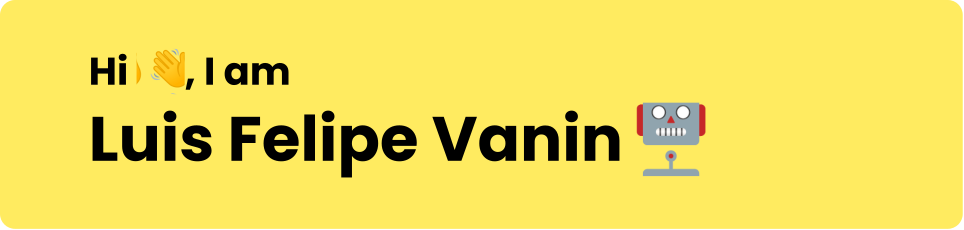

Feliz em aprender coisas novas ✨

**Sobre mim:** Estudante de engenharia da computação pela UFRN. Formado como Dev FullStack pela [@DrivenEducation](https://www.driven.com.br/).

Adoro aprender coisas novas, às vezes até demais! Quase não paro quieto na hora de me aprofundar em novas tecnologias. Em resumo, estou sempre aprendendo 🤓.

### Ferramentas(_Work/Personal_) ⚡

<!-- ### Coisas sobre mim

-   🌱 Eu estou atualmente aprendendo: **Websocket** e **Tailwind**
-   👀 Tecnologias que estou interessado: **Message Brokers**  e **Rust(again)**
-   📫 Como entrar em contato comigo: luisfvaninmartins@gmail.com
-   😄 Pronomes: [ele/deles] -->

<!-- ### Ferramentas 🛠️

 -->

### Linguagens 💻

<!-- 

 -->

### Entre em contato 📞

<!-- <h1 align="center"> 👋 Eae, Eu sou Luis Felipe Vanin Martins </h1> -->

<!--  

 -->
<!--
**LuigiVanin/LuigiVanin** is a ✨ _special_ ✨ repository because its `README.md` (this file) appears on your GitHub profile.

Here are some ideas to get you started:

-   🔭 I’m currently working on ...
-   🌱 I’m currently learning ...
-   👯 I’m looking to collaborate on ...
-   🤔 I’m looking for help with ...
-   💬 Ask me about ...
-   📫 How to reach me: ...
-   😄 Pronouns: ...
-   ⚡ Fun fact: ...
    -->
